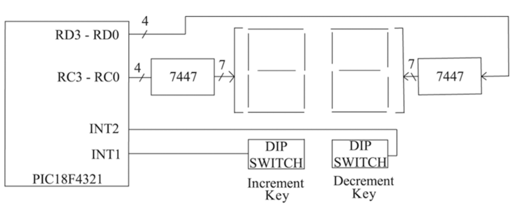
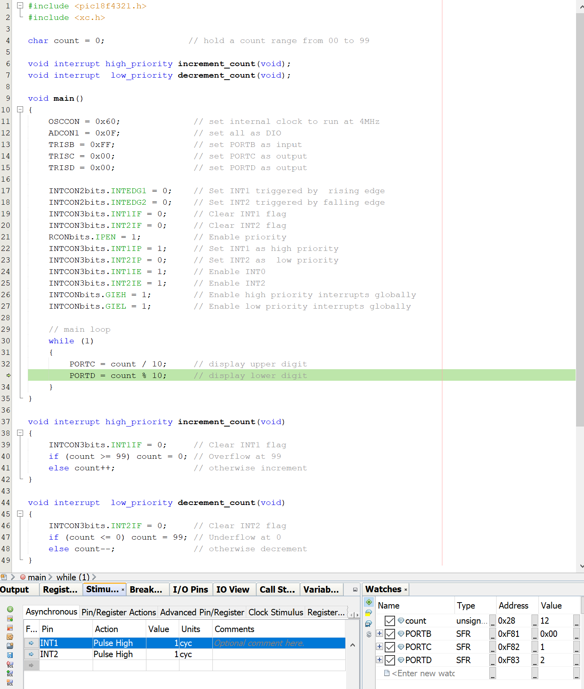

# ECE 3301-02 Assignment 6 - Choi Tim Antony Yung

## Question 1 (15)
Write a PIC18F assembly language code to activate the triggering level of INT0 by rising edge, and, the INT1 and INT2 interrupts by falling edge

```asm
    BSF     INTCON2, 6   ; set   INTCON2 bit 6 for  rising edge triggered INT0
    BCF     INTCON2, 5   ; clear INTCON2 bit 5 for falling edge triggered INT1
    BCF     INTCON2, 4   ; clear INTCON2 bit 4 for falling edge triggered INT2
```

## Question 2 (25)
Write C code to configure interrupts for PIC18F, set interrupt priority of INT0 as the high priority and interrupt priority for INT2 level as low priority, and clear interrupt flags (code for configuring the interrupts are only required)

```c
    ADCON1 = 0x0F;              // Configure INT0-INT2 as digital inputs
    INTCONbits.INT0IF = 0;      // Clear INT0 flag
    INTCON3bits.INT2IF = 0;     // Clear INT2 flag
    RCONbits.IPEN = 1;          // Enable priority
    INTCON3bits.INT2IP = 0;     // Set INT2 as low priority
    INTCONbits.INT0IE = 1;      // Enable INT0
    INTCON3bits.INT2IE = 1;     // Enable INT2
    INTCONbits.GIEH = 1;        // Enable high priority interrupts globally
    INTCONbits.GIEL = 1;        // Enable low priority interrupts globally
```

## Question 3 (60)
Simulate using MPLAB a PIC18F4321-based system as shown in figure below: The system will drive two seven segment digits and monitor two key switches. The system will start displaying 00. If the increment key is pressed, it will increment the display by one. Similarly, if the decrement key is pressed, the display will be decremented by one. The display will go from 00 to 99, and vice versa. Write a C language program to accomplish the above. The system use a 4MHz internal clock. The increment Switch is connected to INT1 (RB1) and the decrement Switch to INT2 (RB2). INT1 is configured as high priority and INT2 as Low Priority. Assume that the high 7-segment display is connected via RC3-RC0 of PORTC while Low 7-segment display via RD3-RD0 of PORTD and two 7447's decoders are used for the displays.



Return the screenshots for
* The MPLAB program code

```c
#include <pic18f4321.h>
#include <xc.h>

char count = 0;                // hold a count range from 00 to 99

void interrupt high_priority increment_count(void);
void interrupt  low_priority decrement_count(void);

void main()
{
    OSCCON = 0x60;              // set internal clock to run at 4MHz
    ADCON1 = 0x0F;              // set all as DIO
    TRISB = 0xFF;               // set PORTB as input
    TRISC = 0x00;               // set PORTC as output
    TRISD = 0x00;               // set PORTD as output

    INTCON2bits.INTEDG1 = 0;    // Set INT1 triggered by  rising edge
    INTCON2bits.INTEDG2 = 0;    // Set INT2 triggered by falling edge
    INTCON3bits.INT1IF = 0;     // Clear INT1 flag
    INTCON3bits.INT2IF = 0;     // Clear INT2 flag
    RCONbits.IPEN = 1;          // Enable priority
    INTCON3bits.INT1IP = 1;     // Set INT1 as high priority
    INTCON3bits.INT2IP = 0;     // Set INT2 as  low priority
    INTCON3bits.INT1IE = 1;     // Enable INT0
    INTCON3bits.INT2IE = 1;     // Enable INT2
    INTCONbits.GIEH = 1;        // Enable high priority interrupts globally
    INTCONbits.GIEL = 1;        // Enable low priority interrupts globally

    // main loop
    while (1)
    {
        PORTC = count / 10;     // display upper digit
        PORTD = count % 10;     // display lower digit
    }
}

void interrupt high_priority increment_count(void)
{
    INTCON3bits.INT1IF = 0;     // Clear INT1 flag
    if (count >= 99) count = 0; // Overflow at 99
    else count++;               // otherwise increment
}

void interrupt  low_priority decrement_count(void)
{
    INTCON3bits.INT2IF = 0;     // Clear INT2 flag
    if (count <= 0) count = 99; // Underflow at 0
    else count--;               // otherwise decrement
}
```

* Interrupt pins values with the corresponding I/O registers showing the increment and the decrement

